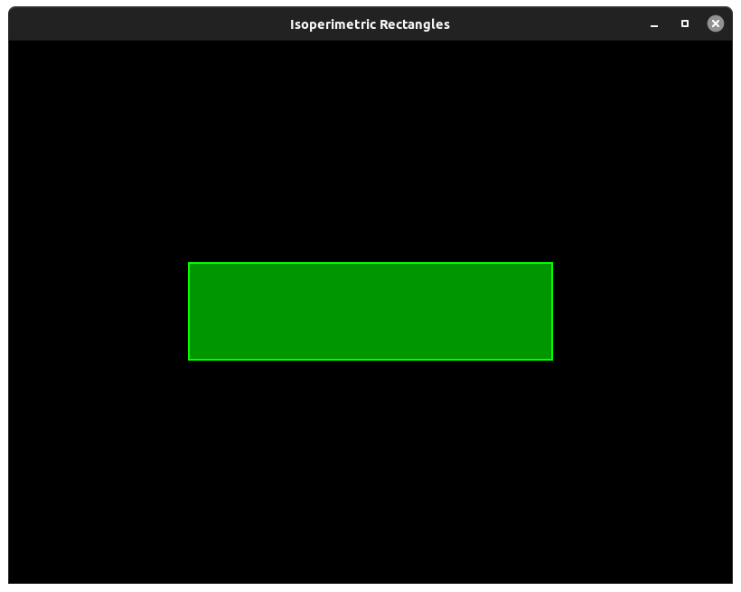
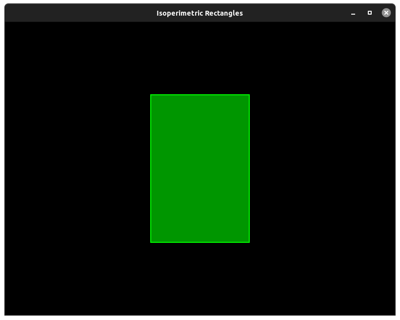

# Isoperimetric Rectangles
A stupid and unuseful program to draw isoperimetric rectangles

## Commands
- up arrow to decrease perimeter lenght
- down arrow to increase perimeter lenght
- right arrow to increase rectangle side lenght
- left arrow to decrease rectangle side lenght
- click the rectangle to change color

## Installation
Install SFML framework
<pre>
sudo apt install libsfml-dev
</pre>
Clone the repository
<pre>
git clone https://github.com/LxAlessandroLx/IsoperimetricRectangles.git
</pre>
Move into the directory
<pre>
cd IsoperimetricRectangles
</pre>
Create the build folder
<pre>
mkdir build
</pre>
Build the project
<pre>
make
</pre>
And execute it
<pre>
make run
</pre>

## Usage
<pre>
Usage: 
 IsoperimetricRectangles [options]

Options:
 -a                        rectangle side lenght (default = 400)
 -p, --perimeter           rectangle perimeter lenght (default = 1500)
 -e, --epilepsy            enable epilepsy mode, 1 to activate or 0 to deactivate (default = 0)
 -h, --help                display this help
</pre>

## Screenshots

